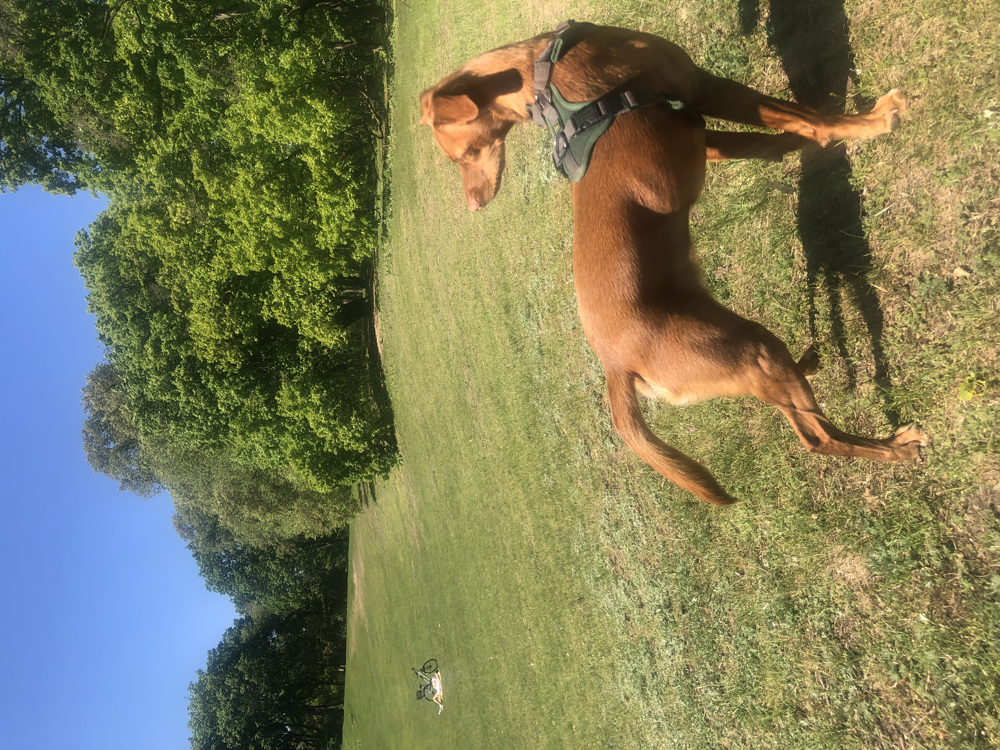

# Hey, I'm Vishaki. Nice of you to drop by!

**Professional me**  
I'm a Data Analyst based in Berlin, with a background in linguistics, communication and teaching.
I'm passionate about using data to drive social and business outcomes through powerful storytelling and clear, insightful visualizations.

**Personal me**  
What about outside of work? Here are a few fun facts:  
  - I am an avid language learner. I speak 7 languages and am currently learning Dutch and Portuguese.
  - I am a football coach for a girls' U-11 football team in Berlin.
  - I love anything to do with the written word: puzzles, novels, texting, and in-depth journalism are all very much my jam.

---

## Problem-solving and Portfolio projects

### [From Margins to Main Stage](https://github.com/vishakiv/Margins_To_Main_Stage)
Analyzed historical Women's World Cup data using Python and data from FBref and Kaggle.
Created an interactive web-app that incorporates visualizations and journalistic story-telling to present a data-driven narrative around the development of international women's football.

---

## Skills
**Languages & Libraries**

**Tools**

---

### 🌐 Let’s connect! Feel free to reach out if you want to chat or collaborate

- 📧 **Email**: [vishaki@gmail.com](mailto:vishaki@gmail.com)
- 🔗 **LinkedIn**: [linkedin.com/in/vishakiv](https://linkedin.com/in/vishaki)

---

### 💻 Tech Stack
 
   
 
 
 

 
 
 

---

### 🐕 My precious doggo Romi 

